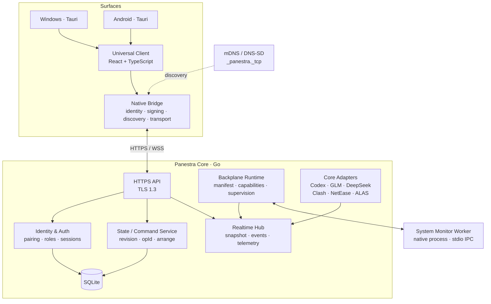

<div align="center">


# Panestra

### ONE CORE, EVERY DEVICE.

**A local-first personal control plane for the screens you already use.**  
让 Windows 成为核心，把状态、工具、媒体与自动化能力带到电脑、手机和平板。

<br />

[快速开始](#快速开始) ·
[功能](#功能) ·
[接入能力](#接入能力) ·
[架构](#架构) ·
[安全](#安全) ·
[源码构建](#源码构建) ·
[更新日志](./CHANGELOG.md) ·
[Releases](https://github.com/890mn/Panestra/releases) ·
[Issues](https://github.com/890mn/Panestra/issues)

<br />


</div>

> [!NOTE]
> Panestra 仍处于早期开发阶段。当前主要面向 **Windows x64** 与 **Android 10+ ARM64**，接口、插件能力与 UI 仍可能快速变化。

## Panestra 是什么？

Panestra 不是远程桌面，也不只是系统监控面板。

它把一台 Windows PC 作为 **Panestra Core**：工作空间、布局、设备身份、权限和实时状态都由 Core 统一管理；桌面、手机和平板则作为不同的 **Surface**，使用同一套 React / TypeScript 界面连接它。

你可以把系统指标、Codex 用量、模型账户、音乐播放器、代理状态、自动化任务，以及之后更多本机软件或硬件能力，组织成同一套可编辑的 Workspace。

**同一个 Core，不同的屏幕，不同的布局。**

## 功能

<table>
<tr>
<td width="50%" valign="top">

### 自由编排的 Workspace

卡片可以移动、缩放、交换和自动整理，并支持 Undo / Redo。

Desktop、Tablet、Mobile 分别使用 **12 / 8 / 4 列布局**。同一个 Widget 可以共享数据与配置，同时在不同 Surface 保存独立位置和尺寸。

</td>
<td width="50%" valign="top">

### 实时状态与跨端同步

Core 维护权威状态，客户端通过 HTTPS / WebSocket 同步。

配置修改使用 revision 与 operation ID 做冲突控制和幂等；实时指标按 topic 订阅，慢客户端不会阻塞 Core。

</td>
</tr>
<tr>
<td width="50%" valign="top">

### 插件与本机适配

System Monitor 已通过 Panestra Backplane 作为独立 Worker 运行，使用 manifest、capability 授权、健康检查与崩溃重启。

Codex、账户额度、Clash、网易云音乐和 ALAS 目前由 Core adapters 接入。

</td>
<td width="50%" valign="top">

### Local-first 与设备身份

数据默认留在自己的 Core 上。

首次连接需要配对；客户端固定 Core 公钥指纹，设备使用独立密钥身份，Owner 可以批准、分配角色或撤销设备。

</td>
</tr>
</table>

## 接入能力

| 能力 | 当前实现 | 可做什么 |
| --- | --- | --- |
| **System Monitor** | Backplane Plugin | CPU、内存、磁盘、网络、主机信息；授权后锁定 Windows 会话 |
| **Codex** | Core Adapter | 读取本机 Codex ChatGPT 订阅额度、剩余额度与重置时间 |
| **GLM Coding Plan** | Core Adapter | 查询智谱中国区 Coding Plan 用量窗口与工具用量 |
| **DeepSeek** | Core Adapter | 查询 API 账户人民币 / 美元余额 |
| **网易云音乐** | Core Adapter | 当前歌曲、歌手、封面与播放状态；授权后播放、暂停、切歌与调整进度 |
| **Clash Verge** | Core Adapter | 代理模式、实时流量、策略组状态；授权后切换模式与节点 |
| **ALAS** | Core Adapter | 查看实例状态、当前任务、等待任务与下一次调度 |

读取能力和控制能力分开授权。设备也有独立角色：Viewer 只读，Operator 可以编辑和执行允许的操作，Owner 负责设备、权限与高风险设置。

## Dashboard

Panestra 的 Dashboard 不是固定模板，而是可编排页面。

- 创建页面并添加 Widget
- 拖动、Resize、交换、自动对齐
- 网格位置与自由尺寸实时预览
- Widget 内部内容可以调整顺序、列宽和对齐
- 不同尺寸可使用不同 presentation
- Desktop / Tablet / Mobile 保存独立布局
- 白昼、黑夜或跟随系统主题
- 自定义点缀色
- 离线保留最近快照，重新连接后恢复实时状态

布局编辑只在手势结束时提交持久化变更；拖动过程保持本地预览，从而避免把每一帧移动都写入数据库。

## 快速开始

### 1. 在 Windows 启动 Core

优先从 [GitHub Releases](https://github.com/890mn/Panestra/releases) 下载对应版本。尚未提供安装包时，可以按下方的源码构建流程运行。

首次启动时，Windows 应用会同时启动 Panestra Core。

### 2. 启用 System Monitor

进入 **插件 → System Monitor**，授予读取系统指标的能力，然后把需要的 Widget 添加到工作空间。

### 3. 配对 Android

在 Windows 打开 **设备与连接 → 添加设备**。

Android 与 PC 位于同一局域网时，可以通过 mDNS 自动发现 <code>_panestra._tcp</code> 服务，也可以扫描配对二维码或手工填写 HTTPS Endpoint。

客户端会先验证 Core 身份指纹，再提交设备公钥和签名挑战；Windows 端批准后完成配对。

### 4. 从任意 Surface 编辑

手机、平板和桌面都可以编辑 Workspace。数据与 Widget 实例共享，但各 breakpoint 的布局分别保存。

## 架构

下面这张图按当前代码组织生成，而不是未来规划图：



### 数据同步

Core 是唯一写入权威节点。

持久化修改走 **Command → revision check → SQLite transaction → canonical event**。客户端提交 <code>baseRev</code>，冲突时 Core 返回当前 revision 与状态。

WebSocket 连接首先认证，然后依据客户端的 <code>lastServerSeq</code> 补发事件并发送最新 snapshot。Telemetry 使用独立队列和 topic subscription；队列过慢时优先丢弃旧 telemetry，而不是拖住全局状态事件。

### Backplane

当前 System Monitor 的执行链路已经与 Core 主进程隔离：

```text
manifest.json
     ↓
Backplane Runtime
     ↓ stdio framed IPC
System Monitor Worker
     ↓
Sources / Actions
```

Runtime 会校验 plugin ID、版本、协议和 manifest digest；只有 manifest 声明且被用户授权的 capability 才会授予 Worker。Worker 失去健康响应或崩溃后会被停止并按退避策略重启。

## 安全

Panestra 未来可能拥有读取系统状态、控制软件甚至执行高风险 Action 的能力，所以安全边界从第一版就存在。

当前代码包括：

- **TLS 1.3**：Core 只通过 HTTPS / WSS 提供主接口
- **Core 身份固定**：Core 使用 P-256 身份密钥，客户端验证公钥指纹和签名证明
- **设备挑战认证**：设备以自己的公钥完成 challenge-response，不用永久 bearer token 代替设备身份
- **短期 Session**：登录后会话有过期时间；设备被撤销后已有连接也会失效
- **配对批准**：新设备必须进入 Pairing Window，并由 Owner 批准角色
- **Local bootstrap**：首次认领只能从 Core 本机完成
- **Role + Capability**：设备角色与插件 capability 是两层权限
- **Origin / rate limit / request limits**：Core 对 Web Origin、请求速率和消息尺寸做限制
- **OS Secret Storage**：Windows 使用 DPAPI；Android 原生端使用 Keystore
- **发现不等于信任**：mDNS 只负责找到候选 Endpoint，身份仍由 TLS、公钥指纹和应用层认证确认

LAN、Tailscale、ZeroTier、FRP 或其他端口映射只改变 **Connectivity**；它们不会绕过 Panestra 自己的身份与授权。

## Windows 后台模式

在 **设置 → 后台服务** 可以让桌面窗口退出，而 Core 与已启用的能力继续运行。系统托盘可以恢复界面或停止 Panestra。

也可以单次使用：

<pre><code>panestra-desktop.exe --background</code></pre>

当前后台模式仍要求 Windows 用户保持登录。

## 特殊适配说明

<details>
<summary><b>Codex</b></summary>

在 Windows 的 **插件 → Codex → 额度与设置** 授权读取。当前读取本机已有的 Codex ChatGPT 登录状态，不需要把凭据复制到移动端。

</details>

<details>
<summary><b>GLM Coding Plan / DeepSeek</b></summary>

由 Owner 在对应适配器中配置 API Key。凭据只在 Core 电脑上加密保存，不进入工作空间同步，也不会包含在普通 Workspace 备份中。

GLM 当前使用智谱中国区个人 Coding Plan 用量接口；DeepSeek 查询 API 账户余额。

</details>

<details>
<summary><b>Clash Verge</b></summary>

可以自动发现本机控制器，也可以手工配置控制器地址和 Secret。读取状态与执行模式 / 节点切换是独立授权。

</details>

<details>
<summary><b>网易云音乐</b></summary>

默认通过 Windows 系统媒体会话读取和控制播放器。部分客户端版本不提供完整时间轴时，可以启用可选的本机进度通道。

该通道默认只监听本机；若启用，需要以远程调试参数启动网易云播放器。具体兼容性仍取决于客户端版本。

</details>

<details>
<summary><b>ALAS</b></summary>

ALAS 通过本机只读桥接读取已载入实例、当前任务与调度信息。当前不会通过 Panestra 控制 ALAS 任务执行。

</details>

## 技术栈

<div align="center">

**Go** · **React** · **TypeScript** · **Tauri v2** · **SQLite** · **WebSocket**

</div>

| Layer | Implementation |
| --- | --- |
| Core | Go |
| Universal Client | React + TypeScript |
| Windows / Android shell | Tauri v2 |
| Native bridge | Rust + Kotlin |
| Persistence | SQLite |
| Realtime | HTTPS + WebSocket |
| Discovery | mDNS / DNS-SD |
| Plugin runtime | Out-of-process native worker |
| Layout | 12 / 8 / 4-column responsive grid |

## 源码构建

### Requirements

- Node.js 22.12+
- npm
- Go 1.27+
- Rust stable 1.90+
- MSVC C++ Toolchain
- Windows SDK
- WebView2

Android 额外需要 JDK 17、Android SDK 36、Build Tools 36、NDK 28.2.13676358，以及 Rust <code>aarch64-linux-android</code> target。

### Clone

<pre><code>git clone https://github.com/890mn/Panestra.git
cd Panestra
npm ci</code></pre>

### Core + Web

<pre><code>.\scripts\build.ps1
.\scripts\start.ps1</code></pre>

默认 Core Endpoint 为 <code>https://localhost:9443</code>，本地数据存放在 <code>.data</code>。

### Windows

<pre><code>.\scripts\build.ps1 -Desktop</code></pre>

安装包输出到 <code>shell/desktop/target/release/bundle/nsis</code>。

### Android

<pre><code>rustup target add aarch64-linux-android
.\scripts\build-android.ps1 -Debug -OptimizedNative</code></pre>

APK 输出到 <code>shell/desktop/gen/android/app/build/outputs/apk/arm64/debug</code>。

### Verify

<pre><code>.\scripts\verify.ps1</code></pre>

验证脚本覆盖 TypeScript、Prettier、gofmt、rustfmt、Go vet、Go tests，以及桌面 / 平板 / 手机尺寸的 Playwright 测试。

## Repository

```text
Panestra/
├── core/              Go Core、认证、Store、Realtime、Backplane 与 adapters
├── client/            React / TypeScript Universal Client
├── plugins/system/    System Monitor Backplane Plugin
├── packages/          协议与 Widget / Layout 公共类型
├── shell/desktop/     Tauri Windows / Android shell
├── shell/android/     Android platform entry
├── shell/bridge/      Identity / discovery / native transport bridge
├── assets/branding/   Branding assets
├── scripts/           Build / verify / release scripts
└── tests/             Integration tests
```

## 更新

应用内可以查看版本与更新日志。

Windows 使用 Tauri Updater 对安装包签名进行验证；Android 在安装前校验下载摘要、包名、版本和应用签名。更新过程保留现有布局与设备配对。

完整开发记录见 **[CHANGELOG.md](./CHANGELOG.md)**。

## Contributing

Panestra 目前仍以快速迭代为主。

如果你发现 Bug、希望接入新的本机软件 / Agent / 硬件，或者对跨设备 Dashboard 有新的交互想法，欢迎提交 [Issue](https://github.com/890mn/Panestra/issues)。

---

<div align="center">


### Panestra

**ONE CORE, EVERY DEVICE.**

Built around one idea: **everything can be a plugin.**

</div>
